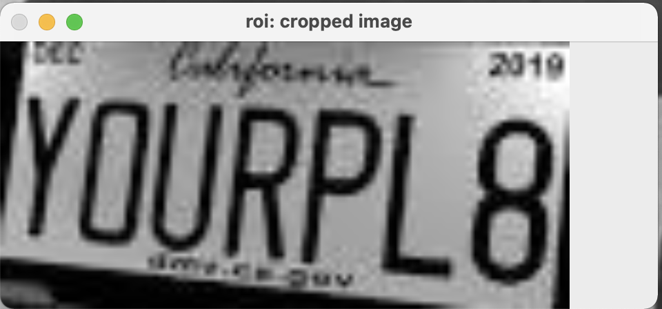
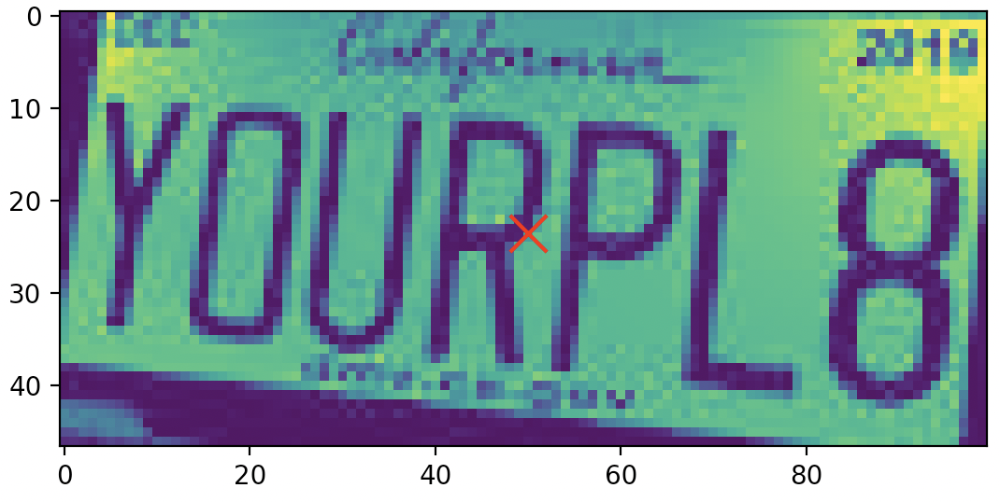
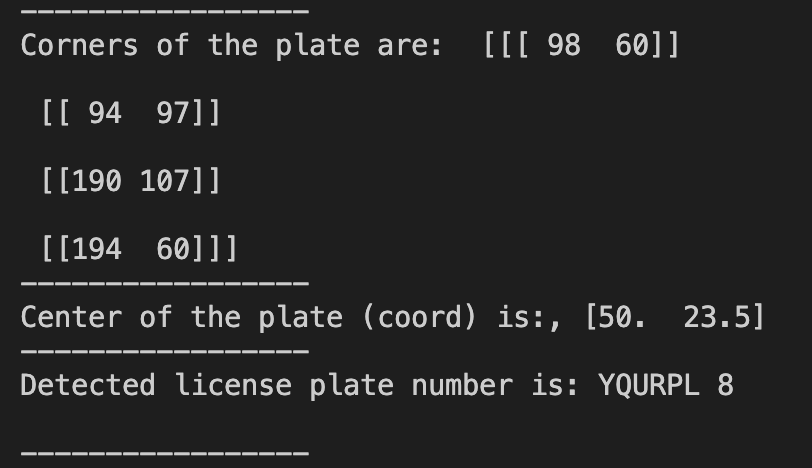
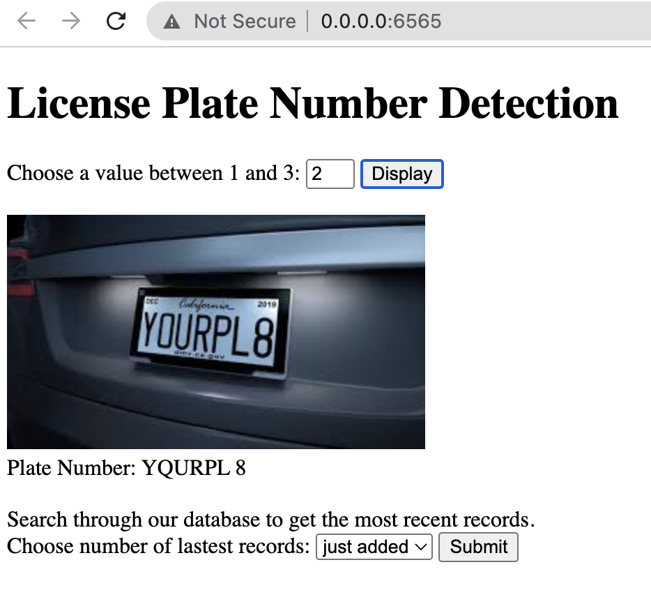
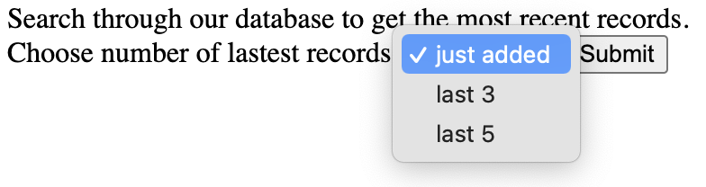
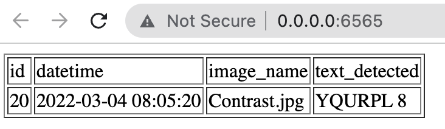

# License Plate Number Recognition
A web application implementing Optical Character Recognition on License Plate Numbers using Python, HTML, JavaScript.

#### Image Processing
`detect_plate()` 
- we processed the image by blurring and thresholding
  - Blur / smoothening
    - to filter high frequency noise from the image
    - an important step in cleaning an image
    - very important for edge detection based algorithms that aim to highlight useful edges in an image
    - Gaussian Blur contains a 2D Gaussian which is convolved with the image.
  - Binary Thresholding
      - after the noise is removed, we only want to keep the edges and mark everything else as non edges
      - one type is Adaptive Thresholding: generates a local threshold for every small region (window) of the image. 
- we did not need to invert the image
- we used cv2.RETR_TREE for the contours instead of cv2.RETR_EXTERNAL 
- to find the rectangular contour, we had to find the second largest contour instead
- given the contours, we found the min and max x/y coord points to crop the image
- we returned the cropped image with the coords of the center
- we also created a plot that showed a marking of our center

`get_text()`  
- we used the `image_to_string` pytesseract function to get the numbers from the image
- we returned the output as a text string

#### Running the System
> The code can be found in `imageprocessing.py`

These were the output images we got from runnning our functions on the Contrast image.

  
  
  

#### Displaying the Results
Link: [https://youtu.be/lS85xtMrsZA](https://youtu.be/lS85xtMrsZA)

For the website, we created a Pyramid app `detector.py` based on the `detect_plate()` and `get_text()` functions.
- `index.html`: this file forms the HTML structure of our webpage. We have one button to click to displat the image & plate and another button to query the SQL table
- `rest.js`: this does the FETCH/POST for the buttons
- `.env`: not on github but contains our sql database credentials
- `init-db.py`: to initialize the database for storing the plate information
- `detector.py`: contnains all the functions to get the photo, detect plate, get text detected, retreieve SQL rows, andto add routes to our webapp

This shows the webpage after clicking the `Display` button for the second plate.

  

To show the SQL database entry, you can search through the most recently added plate to the database or a number of our latest records. We made it simple by searching 1,3, or 5 of the latest records

  
  

#### Real-time Implementation
List down the algorithm for extending this logic/algorithm towards making a real-time system. 
- Algorithm for real-time system
    1. initialize camera object and set frame rate
    2. capture the frames from the Raspberry Pi camera
    3. remove unwanted details from captured image
    4. look for contours
    5. crop the plate out of the image
    6. detect text / plate number
- What aspects will you consider? 
    - We will consider how it would continuously capture the frames, detect multiple license plates in an image, and detect small license plates.
- What can be possible challenges in this implementation? 
    - When capturing all the frames constantly, it may be challenging to save the frame that actually has the image of the license plate. It may take some time to figure out how to select the right frame from the real-time feed, find the right contour, & crop it to detect the plate. Also, if there are multiple license plates in a real-time system, it may be difficult to implement. Lastly, for small license plates/ plates that are too ffar, the algotiyhm may not be able to detect the nuumber.
